1. Run nslookup to obtain the IP address of a Web server in Asia. What is the IP address of that server?

> 输入命令：nslookup www.baidu.com
> 服务的 IP 地址为 26.26.26.53

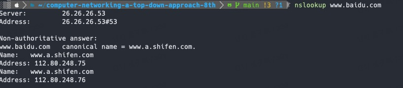

2. Run nslookup to determine the authoritative DNS servers for a university in Europe.

> 查询大连理工大学的权威DNS服务器
> nslookup -type=NS dlut.edu.cn 
> 非权威的DNS响应如下，大多数情况下，非权威的DNS响应是可信的。
> cedrus.dlut.edu.cn 和 gingko.dlut.edu.cn

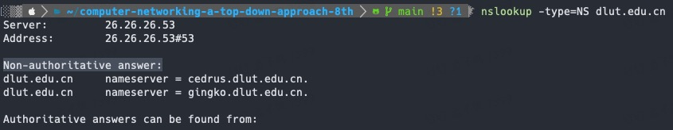

3. Run nslookup so that one of the DNS servers obtained in Question 2 is queried for the mail servers for Yahoo! mail. What is its IP address?

> nslookup yahoo.com
> IP 地址是 26.26.26.53

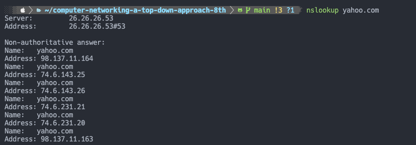

4. Locate the DNS query and response messages. Are then sent over UDP or TCP?

> DNS（Domain Name System）请求通常使用UDP（User Datagram Protocol）协议来发送和接收数据。

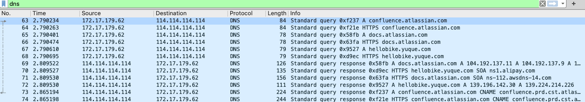

5. What is the destination port for the DNS query message? What is the source port
of DNS response message?

> 发送消息的目标端口号等于接受消息的源端口号，为 53。

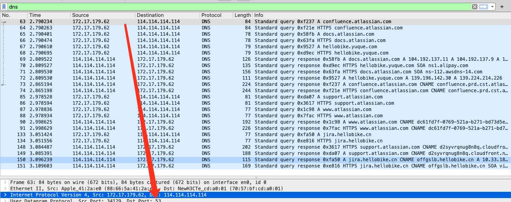

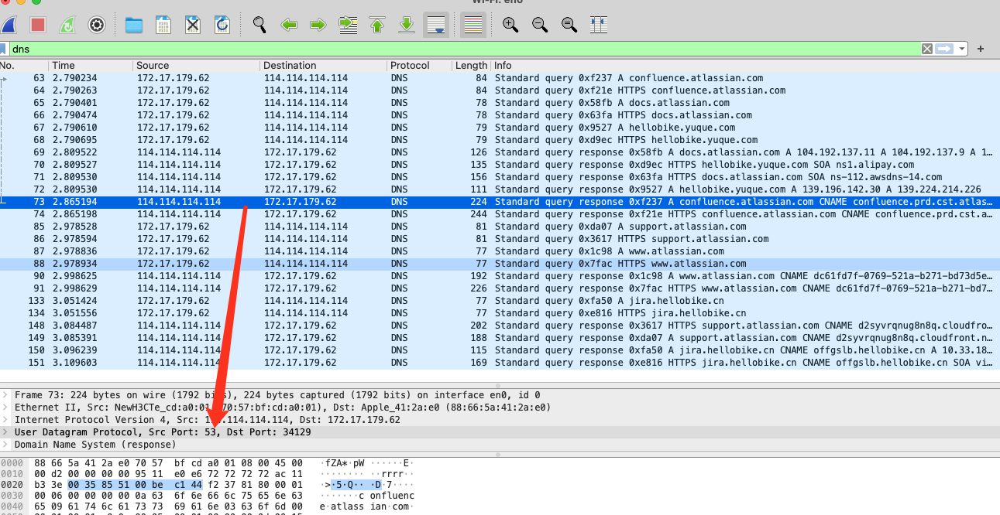

6. To what IP address is the DNS query message sent? Use ipconfig to determine the
IP address of your local DNS server. Are these two IP addresses the same?

> 114.114.114.114
> 但用 scutil -- dns 命令得到的本地 dns 服务器地址是 26.26.26.53
> 两者地址不一样

7. Examine the DNS query message. What “Type” of DNS query is it? Does the
query message contain any “answers”?

> 类型是 A，请求信息里包含域名。

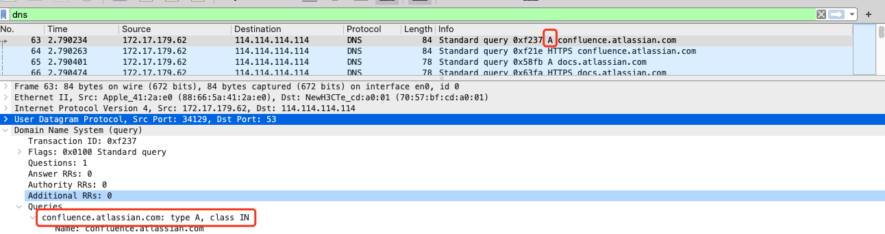

8. Examine the DNS response message. How many “answers” are provided? What
do each of these answers contain?

> 有若干个请求返回。包括 CNAME、A 等

9. Consider the subsequent TCP SYN packet sent by your host. Does the destination IP address of the SYN packet correspond to any of the IP addresses provided in the DNS response message?

> 没有找到。

10. This web page contains images. Before retrieving each image, does your host issue new DNS queries?

> 这个问题也不太清楚，感觉没有再进行 DNS 请求了。

11. What is the destination port for the DNS query message? What is the source port of DNS response message?

> 114.114.114.114

12. To what IP address is the DNS query message sent? Is this the IP address of your default local DNS server?

> 114.114.114.114，不是本地 DNS 服务器。

13. Examine the DNS query message. What “Type” of DNS query is it? Does the query message contain any “answers”?

> A 类型。
> 包含要请求的域名 www.mid.edu

14. Examine the DNS response message. How many “answers” are provided? What do each of these answers contain?

> 虽然我的 wireshark 显示一条返回记录，但是看起来包含三条信息
> 两条 CNAME 和 一条 A 
> 6	1.379301	114.114.114.114	172.17.179.62	DNS	160	Standard query response 0x2247 A www.mit.edu CNAME www.mit.edu.edgekey.net CNAME e9566.dscb.akamaiedge.net A 69.192.8.197
> 从 www.mit.edu 到 www.mit.edu.edgekey.net 到 e9566.dscb.akamaiedge.net 最后到 69.192.8.197

15. Provide a screenshot.

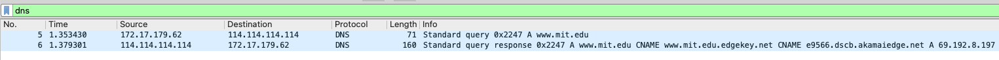

16. To what IP address is the DNS query message sent? Is this the IP address of your default local DNS server?

> 114.114.114.114
> 与本地 DNS 服务器地址不同

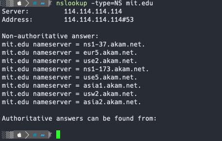

17. Examine the DNS query message. What “Type” of DNS query is it? Does the query message contain any “answers”?

> type 为 NS
> 查询信息里包含源ip，目标ip，源端口号，目标端口号
> Internet Protocol Version 4, Src: 172.17.179.62, Dst: 114.114.114.114
> User Datagram Protocol, Src Port: 62766, Dst Port: 53

18. Examine the DNS response message. What MIT nameservers does the response message provide? Does this response message also provide the IP addresses of the MIT namesers?

> 没有提供ip地址，返回的是不同的 NS 地址

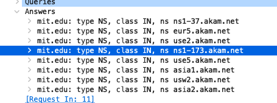

19. Provide a screenshot.

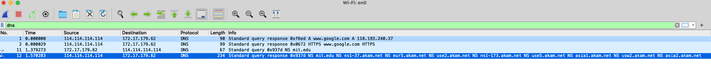

20. To what IP address is the DNS query message sent? Is this the IP address of your default local DNS server? If not, what does the IP address correspond to?

> 18.72.0.3
> 不是
> 代表权威 DNS 服务器

21. Examine the DNS query message. What “Type” of DNS query is it? Does the query message contain any “answers”?

> A
> 查询信息里包含源ip，目标ip，源端口号，目标端口号

22. Examine the DNS response message. How many “answers” are provided? What does each of these answers contain?

> 6 个答案。
> 分别是 A A NS NS A A

23. Provide a screenshot.

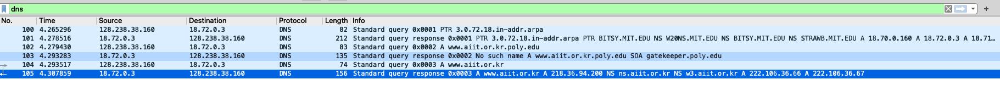