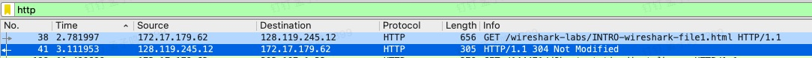

1. List 3 different protocols that appear in the protocol column in the unfiltered packet-listing window in step 7 above.

如下图的 Protocol 列，有 TCP、UDP、DNS、TLSv1.2 等

2. How long did it take from when the HTTP GET message was sent until the HTTP OK reply was received? (By default, the value of the Time column in the packet- listing window is the amount of time, in seconds, since Wireshark tracing began. To display the Time field in time-of-day format, select the Wireshark View pull down menu, then select Time Display Format, then select Time-of-day.)

发送时间：2.781997 （秒
接收时间：3.111953 （秒
耗时：   0.329956 （秒

3. What is the Internet address of the gaia.cs.umass.edu (also known as www- net.cs.umass.edu)? What is the Internet address of your computer?

https://gaia.cs.umass.edu/

4. Print the two HTTP messages (GET and OK) referred to in question 2 above. To do so, select Print from the Wireshark File command menu, and select the “Selected Packet Only” and “Print as displayed” radial buttons, and then click OK.

打印结果如下：

