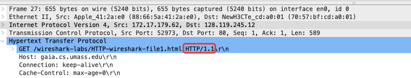
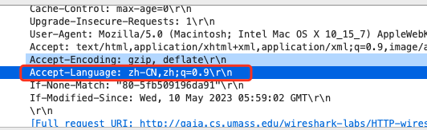
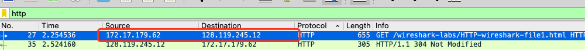
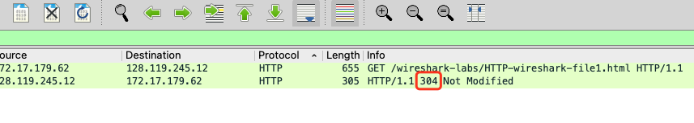
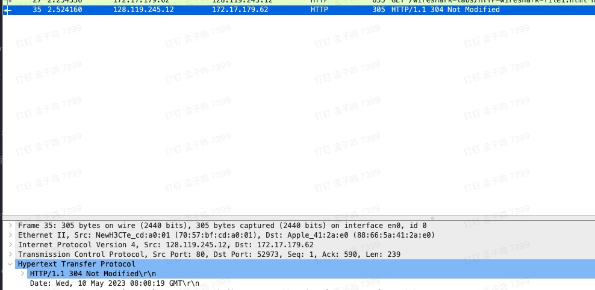
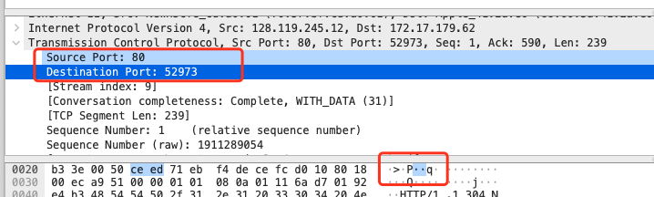
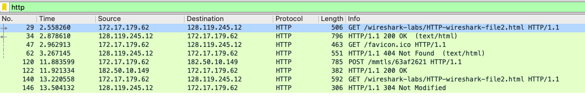
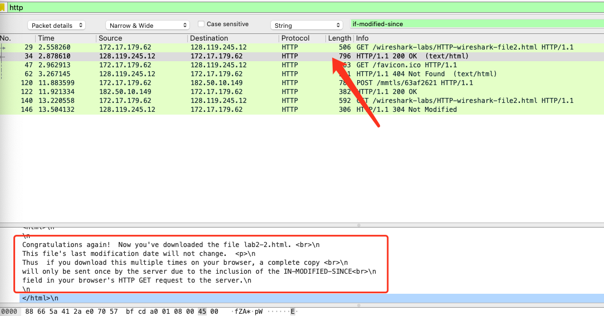
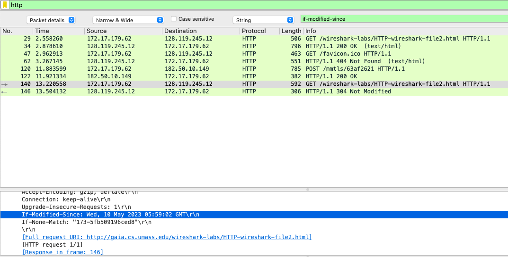
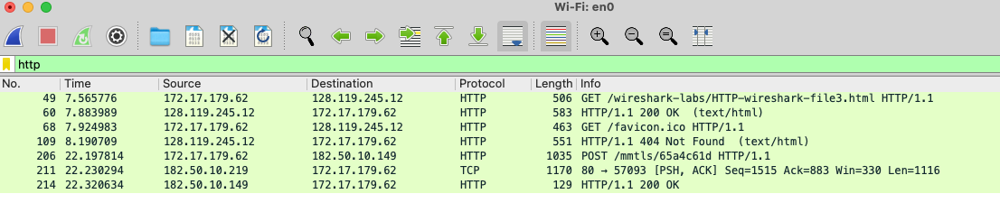

1. Is your browser running HTTP version 1.0 or 1.1? What version of HTTP is the server running?

> 1.1，如下图

2. What languages (if any) does your browser indicate that it can accept to the server?

> zh-CN,zh

3. What is the IP address of your computer? Of the gaia.cs.umass.edu server?

> 我的ip: 172.17.179.62，目标ip: 128.119.245.12

4. What is the status code returned from the server to your browser?

> 返回304，因为我是重复请求，网页没有更改，所以走了缓存；如果是第一次，应返回 200。

5. When was the HTML file that you are retrieving last modified at the server?

> 再次请求时。

6. How many bytes of content are being returned to your browser?

> 305 bytes。

7. By inspecting the raw data in the packet content window, do you see any headers within the data that are not displayed in the packet-listing window? If so, name one.

> source port, destination port 没有显示明文。（这个解答不是很确定 - -

8. Inspect the contents of the first HTTP GET request from your browser to the
server. Do you see an “IF-MODIFIED-SINCE” line in the HTTP GET?

> 第一次没有显示

9. Inspect the contents of the server response. Did the server explicitly return the
contents of the file? How can you tell?

> 返回了文件的内容。因为在返回的报文里看到了网页的内容。

10. Now inspect the contents of the second HTTP GET request from your browser to
the server. Do you see an “IF-MODIFIED-SINCE:” line in the HTTP GET? If
so, what information follows the “IF-MODIFIED-SINCE:” header?

> 看到了。值为 Wed, 10 May 2023 05:59:02 GMT\r\n

11. What is the HTTP status code and phrase returned from the server in response to this second HTTP GET? Did the server explicitly return the contents of the file?
Explain.

> 返回 304 Not Modified。没有返回文件内容。
> 第一次请求时，请求头里没有 IF-MODIFIED-SINCE，服务器返回文件内容，并传一个 last-modified 的值。
> 第二次请求时，请求头里传 IF-MODIFIED-SINCE，服务器判断 last-modified 值不在IF-MODIFIED-SINCE之后，意味着文件没变，直接返回 304，而不返回文件内容。
> 客户端根据状态码 304，决定使用浏览器缓存。

12. How many HTTP GET request messages did your browser send? Which packet
number in the trace contains the GET message for the Bill or Rights?

> 2个。No.49的get请求包含权利内容。

13. Which packet number in the trace contains the status code and phrase associated
with the response to the HTTP GET request?

> No.60 返回了状态码 200，且是 No.49 对应的返回包。

14. What is the status code and phrase in the response?

> 状态 200.HTTP/1.1 200 OK  (text/html)

15.  How many data-containing TCP segments were needed to carry the single HTTP
response and the text of the Bill of Rights?

> 我的电脑用了一个。

16. How many HTTP GET request messages did your browser send? To which
Internet addresses were these GET requests sent?

17. Can you tell whether your browser downloaded the two images serially, or
whether they were downloaded from the two web sites in parallel? Explain.

18. What is the server’s response (status code and phrase) in response to the initial
HTTP GET message from your browser?

19. When your browser’s sends the HTTP GET message for the second time, what
new field is included in the HTTP GET message?
dddd
dddd