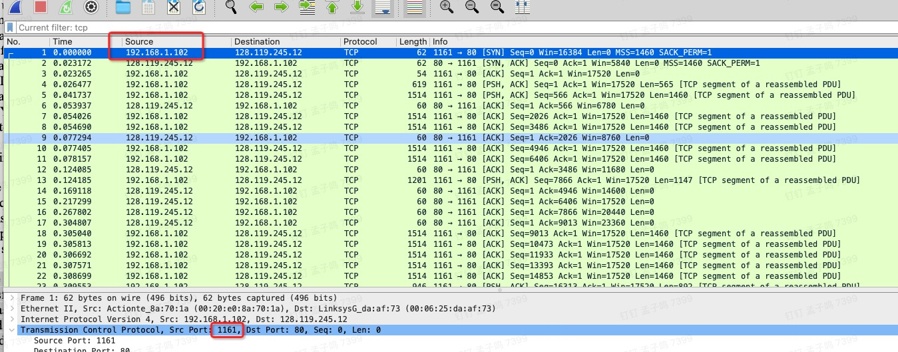
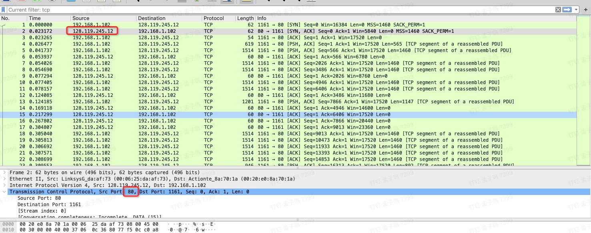

1. What is the IP address and TCP port number used by the client computer (source) that is transferring the file to gaia.cs.umass.edu? To answer this question, it’s probably easiest to select an HTTP message and explore the details of the TCP packet used to carry this HTTP message, using the “details of the selected packet header window” (refer to Figure 2 in the “Getting Started with Wireshark” Lab if you’re uncertain about the Wireshark windows.

> 192.168.1.102
> 端口：1161

2. What is the IP address of gaia.cs.umass.edu? On what port number is it sending and receiving TCP segments for this connection?

> 128.119.245.12
> 端口：80

